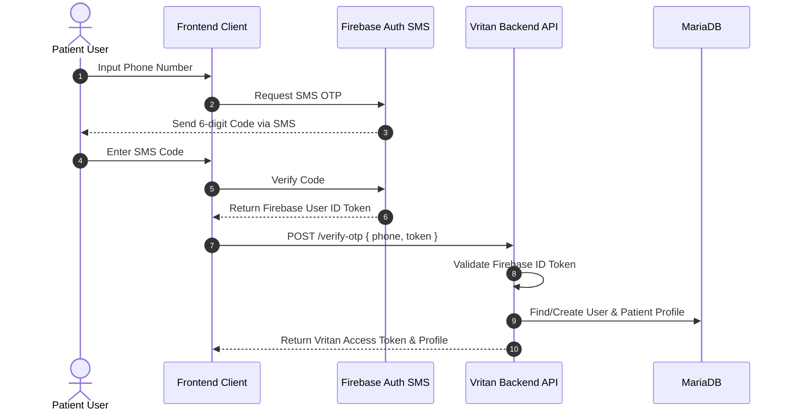
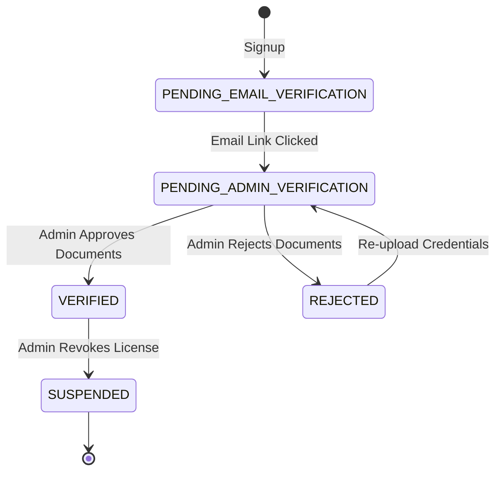
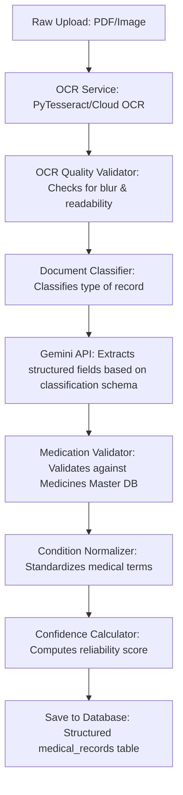
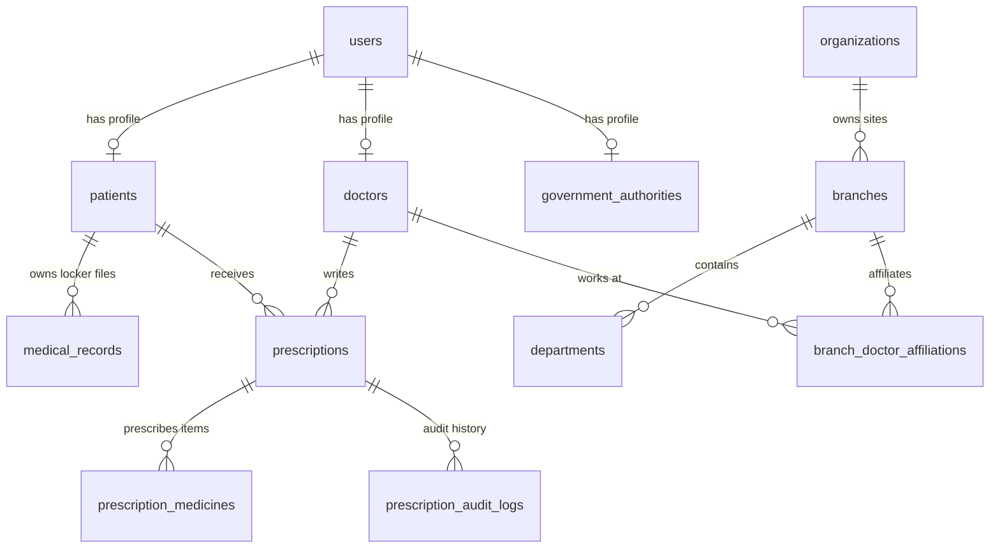
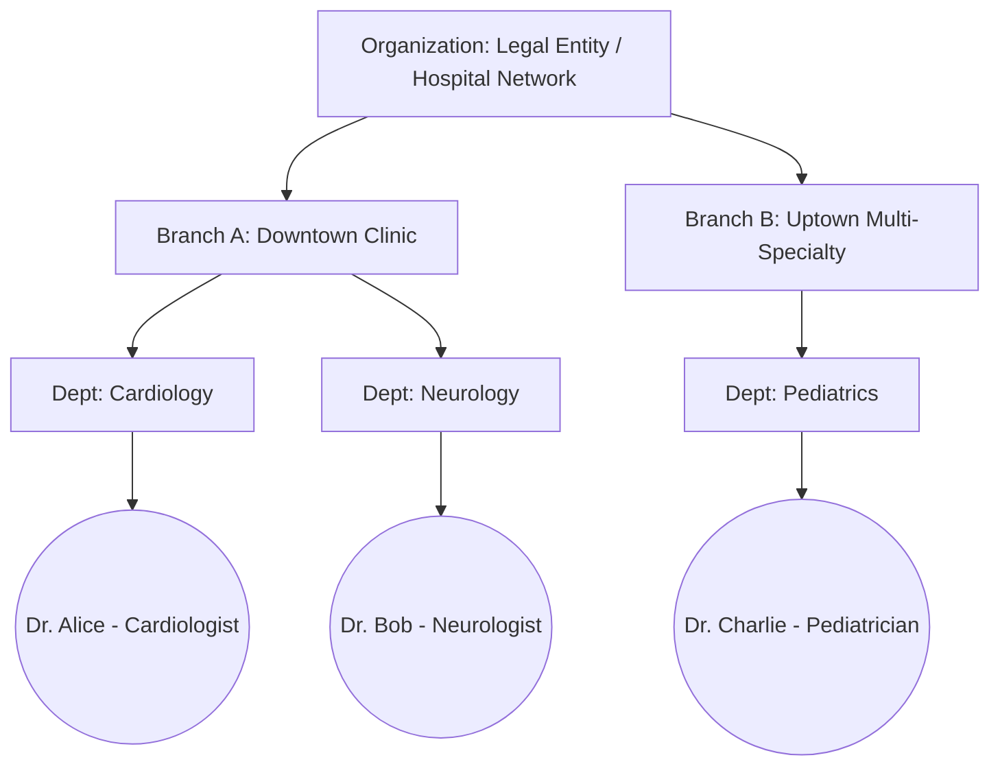

# Software Architecture & Technical Documentation: Project Vritan

This document serves as the complete, comprehensive project knowledge repository for **Vritan** (initially conceptualized as *MediLocker*). It has been prepared to provide full system understanding, architectural flow charts, database diagrams, API references, UI maps, and design justifications for team members, solution architects, and diagram designers.

---

## Table of Contents
1. [Project Overview](#1-project-overview)
2. [System Architecture](#2-system-architecture)
3. [Technology Stack](#3-technology-stack)
4. [Directory & Folder Structure](#4-directory--folder-structure)
5. [Core Modules](#5-core-modules)
6. [Authentication & Authorization Flows](#6-authentication--authorization-flows)
7. [Database Schema & ERD](#7-database-schema--erd)
8. [API Endpoints Directory](#8-api-endpoints-directory)
9. [Frontend Pages & User Journeys](#9-frontend-pages--user-journeys)
10. [Dashboards & Portals](#10-dashboards--portals)
11. [AI Processing & OCR Pipeline](#11-ai-processing--ocr-pipeline)
12. [Verification Workflows](#12-verification-workflows)
13. [Role-Based Access Control (RBAC)](#13-role-based-access-control-rbac)
14. [Enterprise Design Decisions](#14-enterprise-design-decisions)
15. [Current Implementation Status](#15-current-implementation-status)
16. [Future Product Roadmap](#16-future-product-roadmap)
17. [System Visualizations (Mermaid Core)](#17-system-visualizations-mermaid-core)
18. [Project Statistics](#18-project-statistics)
19. [Complete Feature Inventory](#19-complete-feature-inventory)

---

## 1. Project Overview

### What is Vritan?
Vritan is an enterprise-grade secure healthcare collaboration platform and decentralized patient health record (PHR) ecosystem. Originating from "MediLocker," which was conceived as a secure locker for patient records, Vritan has evolved into a robust network connecting **Patients**, **Doctors**, **Hospital Networks/Healthcare Organizations**, **Independent Clinics**, **Laboratories**, and **Government Health Authorities**. 

### Why it Was Created & Problems Solved
1. **Data Fragmentation**: Medical records are isolated inside individual hospital EHR databases. Vritan bridges this with patient-mediated consent management.
2. **Access Inefficiency**: Doctors frequently consult patients without seeing past histories, resulting in redundant tests and diagnosis errors. Vritan provides instant access request/grant loops.
3. **Unstructured Data Sinks**: Medical scans, PDFs, and prescription images are unreadable by analytics engines. Vritan utilizes Gemini AI to transcribe, extract, validate, and structure medical records.
4. **Institutional Scalability**: Standard hospital systems do not model multi-facility chains, branches, and visiting vs. full-time doctor affiliations. Vritan handles complex enterprise organizations.

### Vision & Evolution
```
[ MediLocker Concept ] ---> [ Digital Prescription Engine ] ---> [ Vritan Enterprise Platform ]
(Personal Secure Storage)     (Clinical EHR & Master Dictionary)    (Multi-Branch Health Ecosystem)
```
- **MediLocker Era**: Focus on cloud file storage with direct user access.
- **Intermediary Phase**: Introducing OCR and basic clinical prescription builders.
- **Vritan Era**: A unified, multi-tenant portal architecture with strict RBAC, organizational nesting (Organization -> Branches -> Departments -> Doctors), automated credential verification, public health monitoring for government authorities, and a multi-agent AI engine.

---

## 2. System Architecture

Vritan follows a classic layered services and repository pattern to ensure high performance, security, and decoupling.

```mermaid
graph TD
    subgraph Client Layer
        FE[React Vite Frontend Client]
    end

    subgraph API Gateway & Authentication
        FA[FastAPI Gateway]
        AUTH[JWT / Firebase Auth Middleware]
    end

    subgraph Service Layer (Business Logic)
        ORG[Organization Service]
        APP[Appointment Engine]
        PRE[Prescription Builder Service]
        NOTIF[Event-Driven EventBus & Notification Service]
        AI[AI Pipeline Engine / Gemini Service]
        AUDIT[Audit Service]
    end

    subgraph Infrastructure & Storage
        DB[(MariaDB / SQLite Database)]
        FS[Static Upload Filesystem / Cloud Storage]
        GEMINI[Gemini-2.5-Flash API]
    end

    FE -->|HTTPs Request / JWT| FA
    FA --> AUTH
    AUTH --> ORG
    AUTH --> APP
    AUTH --> PRE
    AUTH --> NOTIF
    AUTH --> AI
    AUTH --> AUDIT

    ORG --> DB
    APP --> DB
    PRE --> DB
    NOTIF --> DB
    AI --> GEMINI
    AI --> DB
    AUDIT --> DB
    
    PRE --> FS
```

### Communication Protocols
- **Client to Backend**: JSON REST API requests with Header Bearer Tokens (`Authorization: Bearer <JWT>`).
- **External Auth Gateway**: Communication via Firebase Web/Admin SDK for Phone OTP verification.
- **Asynchronous Workflows**: Notification triggers and Audit Log creation utilize a service-level `EventBus` to prevent blocking database transactions.
- **Storage Directives**: Static uploads (licenses, signature files, medical records) are stored in secure subdirectories of the filesystem and routed via FastAPI `StaticFiles` mounting.

---

## 3. Technology Stack

| Layer | Technology | Reason for Selection |
| :--- | :--- | :--- |
| **Frontend Core** | React 19, JavaScript (ES6+) | Leverages the virtual DOM, hook-based rendering, and concurrent UI states. |
| **CSS & Design** | TailwindCSS v4 | Utility-first compiler allowing custom curated typography, dark mode variables, and animations. |
| **Client Routing** | React Router DOM v7 | Nested route states, route actions, and programmatic role-based redirects. |
| **Backend Framework** | FastAPI (Python 3.10+) | High-performance asynchronous execution, Pydantic data validation, and autogenerated OpenAPI documentation. |
| **Database ORM** | SQLAlchemy | Declarative modeling, transaction management, and connection pooling. |
| **Storage Engine** | SQLite (Dev) / MariaDB (Prod) | Structured relational storage supporting indexes, foreign keys, and FULLTEXT search. |
| **Authentication** | Firebase SMS OTP + JWT | Bulletproof security for patient mobile authentication combined with lightweight, high-performance JWT tokens for session validation. |
| **AI Core** | Gemini-2.5-Flash API | State-of-the-art vision and text parsing, schema-enforced JSON extraction, and high context capacity. |
| **Task Testing** | Pytest | Fast assertion verification and mock DB setups. |

---

## 4. Directory & Folder Structure

### Frontend Structure
```
frontend/
├── dist/                         # Production bundle
├── public/                       # Favicons, logo vector images
├── src/
│   ├── api/                      # Axios HTTP instance definitions
│   ├── assets/                   # Theme images and shared icons
│   ├── components/               # Reusable UI components
│   │   ├── ErrorBoundary.jsx     # Catches layout rendering crashes
│   │   ├── ProtectedRoute.jsx    # Verifies user JWT and role authorization
│   │   └── PatientLayout.jsx     # Shell navigation for patients
│   ├── context/                  # Context APIs for global states
│   │   ├── AuthProvider.jsx      # Global Auth context (Token, User Profile)
│   │   └── PatientProviders.jsx  # Context specifically for patient state
│   ├── hooks/                    # Reusable custom hooks
│   ├── pages/                    # Views/Pages (Grouped by module)
│   │   ├── admin/                # Sub-admin verification panels
│   │   ├── organization/         # Staff, Branches, Department screens
│   │   ├── Admin.jsx             # Super admin portal dashboard
│   │   ├── DoctorDashboard.jsx   # Doctor workspace and analytics
│   │   ├── LabQueue.jsx          # Test order management
│   │   ├── PatientDashboardOverview.jsx # Patient health vault summary
│   │   ├── PharmacyDashboard.jsx # Pharmacy prescription logs
│   │   └── ...                   # Individual functional pages
│   ├── routes/                   # Module routing tables
│   │   └── patientRoutes.jsx     # Nested lazy-loaded patient sub-routes
│   ├── App.jsx                   # Central routing & theme entry point
│   ├── index.css                 # Global CSS rules, custom scrollbars
│   └── main.jsx                  # React DOM renderer bootstrap
├── package.json                  # Dependencies configuration
└── vite.config.js                # Vite build config
```

### Backend Structure
```
backend/
├── dependencies/                 # Custom FastAPI path dependencies (get_db, verify_role)
├── firebase/                     # Firebase credential configurations
├── repositories/                 # Raw DB operations
│   ├── appointment_repos.py
│   ├── audit_repo.py
│   └── organization_repo.py
├── routers/                      # FastAPI Router endpoints
│   ├── api/v1/                   # Internal API versioning routes
│   │   ├── appointments.py
│   │   ├── laboratory.py
│   │   └── pharmacy.py
│   ├── admin.py                  # Super admin validations & audits
│   ├── auth.py                   # User registrations, OTP, logins
│   ├── doctor.py                 # Doctor clinical dashboard methods
│   ├── organization.py           # Branch, department, and staff methods
│   ├── patient_portal.py         # Record access, dashboard summaries
│   └── prescriptions.py          # Prescription CRUD and master medicines search
├── schemas/                      # Pydantic validation schemas
├── scripts/                      # DB migration & seed scripts
├── services/                     # Business logic layers
│   ├── ai/                       # AI sub-pipelines
│   ├── ai_summary_generator.py   # AI patient friendly summarizations
│   ├── confidence_calculator.py  # OCR and Gemini extraction confidence scores
│   ├── document_classifier.py    # Classifies file as prescription/report/scan
│   ├── email_service.py          # NodeMailer-equivalent triggers (SMTP)
│   ├── gemini_service.py         # Main AI orchestrator
│   └── ...
├── uploads/                      # Local filesystem files (medical_records, signatures)
├── database.py                   # DB engine and session configurations
├── main.py                       # FastAPI application setup and middleware mounting
├── models.py                     # SQLAlchemy database models definitions
└── requirements.txt              # Backend dependencies list
```

---

## 5. Core Modules

### A. Patient Module
Responsible for patient profiles, medical locker storage, and consent approvals. 
- **ABDM Integration**: Includes columns for `abha_id` and `aadhaar_linked`.
- **Consent Flags**: Granular flags: `consent_terms`, `consent_privacy`, `consent_medical_storage`, `consent_analytics`, `consent_research`, `consent_marketing`.
- **Self-Mediated Lock**: Full authority to grant or revoke doctor access request tokens.

### B. Doctor Module
Provides clinical utilities, prescription builders, and timeline views.
- **Verification Path**: Requires administrative verification of medical license numbers.
- **Affiliation Map**: Can be affiliated with one or more organization branches as full-time or visiting consultants.
- **Vitals Input**: BP, HR, Temperature, SpO2, height, weight, BMI computation.

### C. Hospital Organization Module
Handles complex multi-tenant enterprise business setups.
- **Structure**: Parent organization (`organizations` table) -> Branches (`branches` table) -> Departments (`departments` table) -> Branch Affiliations.
- **Staff Control**: Hospital admins can invite, approve, transfer, and terminate doctor branch associations.

### D. Super Admin Module
The regulatory overhead panel of the platform.
- **Verification Workflows**: Approval and rejection flows for Doctors, Hospitals, and Government Authorities.
- **Audit Trails**: Global tracking of critical activities.

### E. Laboratory Module
Connects labs with patient records to facilitate digital record upload.
- **Workflows**: Technicians search patients, record sample collections, enter metric parameters, and trigger verification runs by pathologists.

### F. AI Module
The intelligence core of the application.
- **Orchestration**: Runs document classification, OCR parsing, medicine spelling validation, diagnostic mapping, and patient-centric summarizing.

---

## 6. Authentication & Authorization Flows

Vritan splits its authentication mechanisms between **Phone OTP** for patients and standard **JWT Auth** for enterprise users (Doctors, Hospital Admins, Labs, Government).



### Enterprise Login & Admin Approval Flow
For Doctors, Organizations, Pharmacies, and Authorities:
1. **Registration**: Fill registration forms, uploading licenses and certification files.
2. **Email Verification**: A verification token is emailed to the official address. The status transitions to `PENDING_ADMIN_VERIFICATION`.
3. **Super Admin Review**: Admins review uploaded documents via the Admin Portal.
4. **Approval**: Status changes to `VERIFIED`. An activation email is sent, and the user can now request JWT tokens via `/login/{role}`.



---

## 7. Database Schema & ERD

The database contains tables modeled with relational constraints to enforce referential integrity.

### Data Dictionary

#### 1. `users` Table
Stores login credentials and roles.
- `id` (INT, PK, Auto Increment)
- `role` (VARCHAR(50)): e.g., 'patient', 'doctor', 'hospital_admin', 'lab_tech', 'government_authority'.
- `password` (VARCHAR(255)): Bcrypt-hashed password. Nullable for Patient users.
- `phone_number` (VARCHAR(20), Unique): Nullable.
- `firebase_uid` (VARCHAR(128), Unique): Firebase mapping.
- `email` (VARCHAR(255)): Nullable.

#### 2. `patients` Table
Stores patient demographic and metadata.
- `id` (INT, PK, Auto Increment)
- `user_id` (INT, FK -> `users.id`)
- `patient_uid` (VARCHAR(50), Unique, e.g. `PAT-000123`)
- `full_name` (VARCHAR(100))
- `mobile` (VARCHAR(20), Unique)
- `date_of_birth` (DATE)
- `gender` (VARCHAR(20))
- `blood_group` (VARCHAR(10))
- `abha_id` (VARCHAR(100), Nullable)
- `allergies` (TEXT)
- `consent_status` (BOOLEAN, Default True)
- `created_at` (TIMESTAMP)

#### 3. `doctors` Table
Stores medical practitioner profiles.
- `user_id` (INT, PK, FK -> `users.id`)
- `vritan_id` (VARCHAR(50), Unique, e.g. `VR-DOC-000123`)
- `full_name` (VARCHAR(100))
- `email` (VARCHAR(100), Unique)
- `phone` (VARCHAR(20))
- `medical_license_number` (VARCHAR(100), Unique)
- `is_verified` (BOOLEAN, Default False)
- `verification_status` (VARCHAR(50), Default 'PENDING_EMAIL_VERIFICATION')
- `signature_image_url` (VARCHAR(255))

#### 4. `organizations` Table
Stores hospital networks or independent clinics.
- `id` (INT, PK)
- `organization_uid` (VARCHAR(36), Unique)
- `vritan_id` (VARCHAR(50), Unique, e.g. `VR-HOSP-000123`)
- `name` (VARCHAR(255))
- `verification_status` (VARCHAR(50))
- `is_active` (BOOLEAN)

#### 5. `branches` Table
Physical sites owned by Organizations.
- `id` (INT, PK)
- `organization_id` (INT, FK -> `organizations.id`)
- `name` (VARCHAR(255))
- `address` (TEXT)

#### 6. `medical_records` Table
Stores details of scans, medical documents, and AI extractions.
- `id` (INT, PK)
- `patient_id` (INT, FK -> `patients.id`)
- `record_type` (VARCHAR(20)): 'prescription', 'report', 'scan', 'other'.
- `file_url` (VARCHAR(255))
- `original_filename` (VARCHAR(255))
- `extracted_text` (TEXT)
- `cleaned_text` (TEXT)
- `detected_medicines` (TEXT, JSON array)
- `probable_conditions` (TEXT, JSON array)
- `ai_structured_data` (TEXT, JSON representation)
- `confidence_score` (FLOAT)
- `document_type` (VARCHAR(50))
- `ocr_quality_score` (FLOAT)

#### 7. `prescriptions` Table
Stores structured digital prescriptions created inside the builder.
- `id` (INT, PK)
- `prescription_id` (VARCHAR(50), Unique, e.g. `PR-000213`)
- `doctor_id` (INT, FK -> `doctors.user_id`)
- `patient_id` (INT, FK -> `patients.id`)
- `diagnosis` (TEXT)
- `symptoms` (TEXT)
- `vitals_blood_pressure` (VARCHAR(50))
- `vitals_heart_rate` (INT)
- `vitals_bmi` (FLOAT)
- `status` (VARCHAR(20), Default 'ACTIVE')
- `created_at` (TIMESTAMP)

---

## 8. API Endpoints Directory

Below is the list of key API routes implemented in the Vritan platform.

| Method | Endpoint | Description | Auth | Request Schema (Key Fields) |
| :--- | :--- | :--- | :--- | :--- |
| **POST** | `/send-otp` | Sends phone verification code | Public | `{ "phone": "+9199..." }` |
| **POST** | `/verify-otp` | Validates OTP token, signs user in | Public | `{ "phone": "+9199...", "token": "FirebaseToken" }` |
| **POST** | `/register/doctor` | Doctor registration & file upload | Public | Form-data: License, Certs, Profile info |
| **POST** | `/register-hospital` | Hospital Organization signup | Public | Form-data: Registration Cert, Tax IDs |
| **POST** | `/login/{role}` | Enterprise portal email/pwd login | Public | `{ "email": "doc@...", "password": "..." }` |
| **GET** | `/doctor/dashboard-stats`| Analytical stats for clinical dashboard | Doctor | None |
| **GET** | `/patient-search` | Search patient details by mobile or UID | Doctor | Query params: `q` |
| **POST** | `/appointments/book` | Book doctor scheduling slots | Patient | `{ "slot_id": 10, "appointment_type": "Video" }` |
| **POST** | `/prescriptions` | Create a clinical digital prescription | Doctor | Diagnosis, Symptoms, Medicines array |
| **GET** | `/prescriptions/{id}/audit-logs` | Tracks modifications to prescription data | Doctor | None |
| **GET** | `/admin/doctors` | List practitioners awaiting validation | Admin | None |
| **POST** | `/admin/doctors/{id}/approve`| Activates and verifies practitioner profile | Admin | None |

---

## 9. Frontend Pages & User Journeys

### Patient Journey
```
Landing Page ---> Registration/OTP ---> Dashboard Summary ---> Vault Records & Timelines
                                                   ├── View Prescriptions
                                                   └── Approve/Revoke Doctor Access Requests
```
- **Medical Locker**: Central workspace showing categorized lists of Reports, Prescriptions, Scans. Clicking any document launches the dynamic AI Extraction viewer with mapped medical definitions.
- **Access Requests Notification**: Prompting user to authorize clinical data release keys for doctors requesting files.

### Doctor Journey
```
Register/Submit Certs ---> Admin Verify ---> Dashboard (Vitals/Queue) ---> Patient Selection 
                                                                                ├── View Records (Via OTP Grant)
                                                                                └── Prescription Builder
```
- **Prescription Builder Workspace**: Combines full-text search against the Master Medicine DB, dosage frequency builder, clinical notes inputs, and vitals updates, rendering a finalized printable prescription with a digital doctor signature.

---

## 10. Dashboards & Portals

### Patient Portal
1. **Analytics Summary Card**: Highlighting blood pressure tracks, height/weight logs, and active allergies.
2. **Interactive Timeline**: Events sequenced chronologically (e.g., Doctor Consultations, Diagnostic Uploads, Medication Changes).

### Doctor Dashboard
1. **Queue Management Widget**: List of patients scheduled for the day with appointment status badges (`Checked-In`, `Consultation Started`, `Completed`).
2. **Clinical Insights Widget**: AI-driven medical trends for the patient under consultation.

### Hospital/Organization Admin Portal
1. **Branch Affiliation Mapping**: Add new physical clinics or departments.
2. **Staff Roster Controller**: Track working hours, shift slots, and active/inactive personnel logs.

### Super Admin Portal
1. **Verification Queue**: Document preview modal for reviewing doctor licenses, clinic registrations, and identity certificates.
2. **Global System Auditing Table**: Searchable, immutable platform records.

---

## 11. AI Architecture & OCR Pipeline

The intelligence module parses unstructured text into FHIR-like diagnostic records.



### Pipeline Details
- **Classification**: Documents are categorized into `prescription`, `diagnostic_report`, `discharge_summary`, `scan`, or `other`.
- **Validation Schemas**: Structured extractions adhere to strict JSON schemas defined in `extraction_schemas.py`.
- **Confidence Scoring**: Evaluates text density, OCR structure, and Gemini certainty parameters to output a score from 0.0 to 1.0. If the score falls below a specific threshold (e.g., 0.6), the document is marked as `Needs Verification`.

---

## 12. Verification Workflows

### Doctor Verification Flow
1. **Status: PENDING_EMAIL_VERIFICATION**: Signup complete; verification email dispatched.
2. **Status: PENDING_ADMIN_VERIFICATION**: User verified their email; credentials populated in the Super Admin Verification Queue.
3. **Status: VERIFIED**: Admin reviews credentials and approves. Access to doctor features is granted.
4. **Status: REJECTED**: Admin rejects credentials. User receives rejection notice with reasoning and can re-upload certificates.

---

## 13. Role-Based Access Control (RBAC)

Vritan enforces strict role authorization logic.

| Role | Scope | Key Permissions | Key Restrictions |
| :--- | :--- | :--- | :--- |
| **Patient** | Personal files & locker | Read/write own health metrics; authorize access keys | Cannot view other patients; cannot write prescriptions |
| **Doctor** | Consultation & Prescriptions | Search patients; write prescriptions; view approved records | Cannot access records without explicit consent approvals |
| **Hospital Admin** | Organizational configuration | Manage branches, staff roles, and rosters | Cannot write prescriptions; cannot view patient clinical charts |
| **Lab Technician** | Diagnostic uploads | Upload reports; update test parameters | Cannot alter prescriptions; cannot view patient locker history |
| **Super Admin** | System regulation | Approve/reject registrations; review global logs | Cannot write clinical prescriptions; cannot view patient vaults |

---

## 14. Enterprise Design Decisions

1. **Why Organizations Instead of Hospitals?**
   Enables multi-facility support. Single legal entities (e.g., Max Healthcare) can run hospital branches, lab clinics, and pharmacies under one corporate structure.
2. **Why Branch Doctor Affiliation Model?**
   Reflects the medical industry standard where doctors consult at multiple hospitals or run independent practices concurrently.
3. **Why Firebase OTP + Lightweight JWT?**
   Phone OTP provides a secure, passwordless authentication flow for patients. Transitioning this verification to standard backend JWT tokens keeps API endpoints lightweight and high-performing.
4. **Why Secure Public IDs?**
   Auto-incremented PKs (e.g., 12) are vulnerable to scraping attacks. Public IDs (e.g., `PAT-000123`, `VR-DOC-000142`) provide secure, clean reference handles.
5. **Why an Event-Driven EventBus?**
   Ensures non-blocking execution. Long-running actions like dispatching SMTP emails or logging audit records are handled asynchronously.

---

## 15. Current Implementation Status

### Completed
- **Identity & Auth**: Firebase OTP and enterprise role authentication.
- **Enterprise Structure**: Organization, branch, department, and staff roster tables.
- **AI OCR Pipeline**: Automated categorization, medicine dictionary matching, and confidence score mapping.
- **Prescription Builder**: Electronic prescriptions with doctor signatures and change logs.

### In-Progress
- **Laboratory Queue**: Live tracking from sample collection to pathologist verification.
- **Patient Dashboard Summary**: Timeline cards showing chronological medical histories.

---

## 16. Future Product Roadmap

1. **Integrated Lab Operations**: Enabling lab technicians to push results directly to the patient's record.
2. **Pharmacy Dispensing Queue**: Allowing pharmacies to receive digital prescriptions directly from the doctor.
3. **ABDM Sandbox Certification**: Completing official clinical testing loops to achieve national standard certification.
4. **Smart Diagnostic Trends**: Charting lab result parameters (e.g., HbA1c history) over time.

---

## 17. System Visualizations (Mermaid Core)

### Database ER Diagram


### Complete Organization Hierarchy


---

## 18. Project Statistics

- **Total Implemented Modules**: 7 (Patient, Doctor, Organization, Lab Portal, Admin Portal, AI Core, Auth Core)
- **Database Tables**: 23 Relational Tables
- **Main REST API Endpoints**: ~45 Endpoints
- **Supported User Roles**: 6 (Patient, Doctor, Hospital Admin, Lab Technician, Pharmacist, Government Authority, Super Admin)
- **AI Core Orchestrations**: Document classification, OCR cleaning, Gemini schema mapping, validation.

---

## 19. Complete Feature Inventory

### Patient Locker
- Dynamic OCR and document parsing with metadata generation.
- Access token consent approval popup panel.
- Unified health history timeline.

### Practitioner Workspace
- Full-text autocomplete search against the Medicines Master DB.
- Comprehensive vital tracking (BMI auto-calculator).
- Immutable, searchable prescription history logs.

### Enterprise Panel
- Organization profile management (incorporating legal structures).
- Department and branch roster builder.
- Staff rosters and doctor branch transfer capabilities.

### Intelligent Core
- Image preprocessing and compression.
- Medical terminology standardizer.
- Text translation and summary engine.
